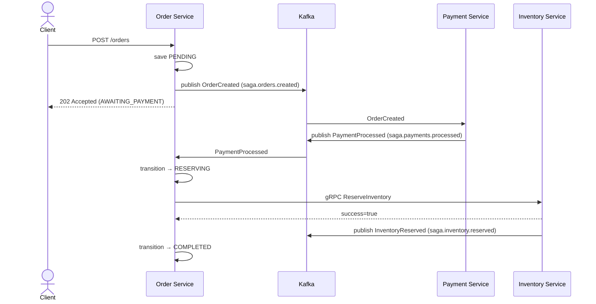
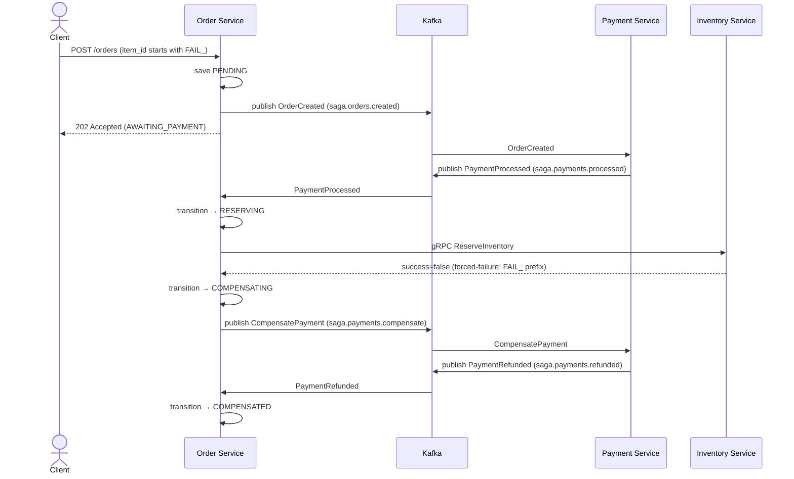

# OrderSagaDemo

A **Go 1.22** portfolio project demonstrating the **Saga orchestration pattern** on a microservices stack. An HTTP-fronted Order Service drives a distributed transaction across a Payment Service (Kafka) and an Inventory Service (gRPC), with full OpenTelemetry observability piped through an OTel Collector to Prometheus, Loki, Tempo, and Grafana.

---

## Architecture

- **Order Service** (`HTTP :8080` | Kafka | gRPC client) — owns the saga state machine; publishes `OrderCreated` / `CompensatePayment`; calls `ReserveInventory` gRPC.
- **Payment Service** (Kafka only) — stateless worker; consumes `OrderCreated` → emits `PaymentProcessed`; consumes `CompensatePayment` → emits `PaymentRefunded`.
- **Inventory Service** (`gRPC :9090` | Kafka) — serves `ReserveInventory` / `ReleaseInventory`; emits `InventoryReserved` / `InventoryReleased` audit events.
- **Kafka backbone** (KRaft, no Zookeeper) — topics auto-created on first produce (`KAFKA_AUTO_CREATE_TOPICS_ENABLE=true`, R-8).
- **OTel → Collector → Prometheus / Loki / Tempo / Grafana** — all three services export OTLP/gRPC to a single collector that fans out to the observability backends.

---

## Prerequisites

| Tool | Version |
|------|---------|
| Docker + Docker Compose | 24+ |
| Go | 1.22+ |
| buf (optional, proto regen) | 1.35.x |
| kind (optional, k8s) | 0.24.0 |
| helm (optional, k8s) | 3.x |

---

## Quick Start

```bash
# 1. Start the full stack (Kafka + observability + three services)
make up

# 2. Happy path — payment succeeds, inventory reserved
bash scripts/create-order.sh

# 3. Compensation path — inventory forced to fail, payment refunded
bash scripts/create-order-fail.sh
```

Watch the results in Grafana at **http://localhost:3000** (no login required).

---

## Observability URLs

| Service | URL |
|---------|-----|
| Grafana | http://localhost:3000 |
| Prometheus | http://localhost:9090 |
| Loki (API) | http://localhost:3100 |
| Tempo (API) | http://localhost:3200 |
| OTel Collector metrics | http://localhost:8888/metrics |

---

## Forced-Failure / Compensation Demo

Any order item whose `item_id` starts with `FAIL_` (controlled by `INVENTORY_FAIL_ITEM_PREFIX`, default `FAIL_`) triggers forced failure in the Inventory Service gRPC handler. The saga then:

1. Payment succeeds → `PaymentProcessed` emitted.
2. `ReserveInventory` gRPC returns `success=false`.
3. Order Service publishes `CompensatePayment` to `saga.payments.compensate`.
4. Payment Service refunds → emits `PaymentRefunded`.
5. Order transitions to `COMPENSATED`.

**How to observe the rollback:** In Grafana, open the **Saga Overview** dashboard. Click the `trace_id` link on a failed order row to jump directly to the Tempo trace. Each compensation step appears as a child span. Switch to the **Logs** tab (Explore → Loki) and filter by `trace_id` to see correlated log lines from all three services — this is the trace-to-log correlation enabled by OTel context propagation across Kafka headers (W3C `traceparent`).

---

## Kafka Topic Strategy (R-8)

Topics are **auto-created** on first produce via `KAFKA_AUTO_CREATE_TOPICS_ENABLE=true` on the Confluent cp-kafka KRaft image. No init container or topic-creation job is required. Topic names follow the `saga.<domain>.<event>` convention:

| Topic | Producer | Consumer |
|-------|----------|----------|
| `saga.orders.created` | Order | Payment |
| `saga.payments.processed` | Payment | Order |
| `saga.payments.failed` | Payment | Order |
| `saga.payments.compensate` | Order | Payment |
| `saga.payments.refunded` | Payment | Order |
| `saga.inventory.reserved` | Inventory | — (audit) |
| `saga.inventory.released` | Inventory | — (audit) |

---

## Saga Sequence Diagrams

### Happy Path



### Compensation Path



---

## Make Targets

| Target | Description |
|--------|-------------|
| `make generate` | Re-generate gRPC stubs from proto (requires buf) |
| `make build` | `go build ./...` |
| `make test` | `go test ./...` |
| `make vet` | `go vet ./...` |
| `make lint` | `golangci-lint run` |
| `make up` | Start full Docker Compose stack |
| `make down` | Stop and remove volumes |

---

## Kubernetes / Helm

```bash
# Plain manifests
kubectl apply -f deploy/kubernetes/

# Helm
helm install ordersagademo deploy/helm/ordersagademo --namespace ordersagademo --create-namespace
```
