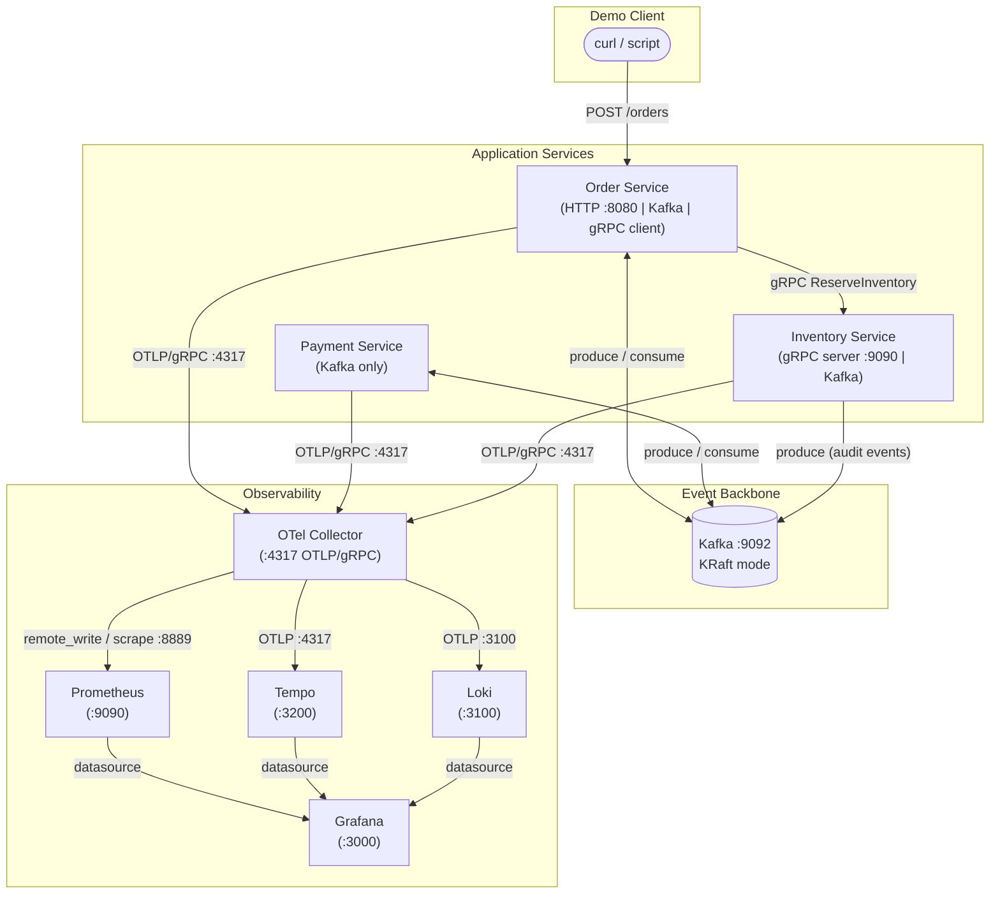
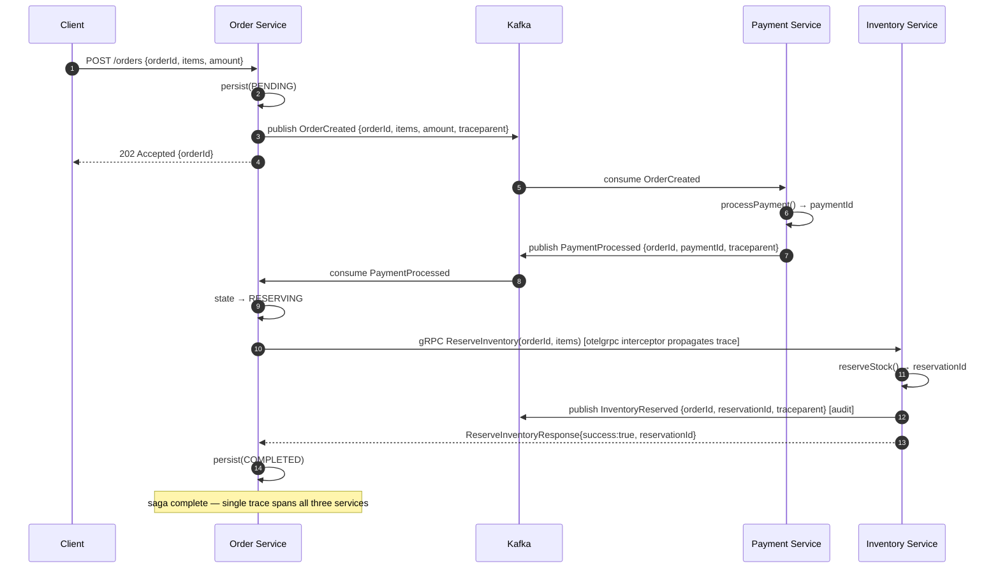
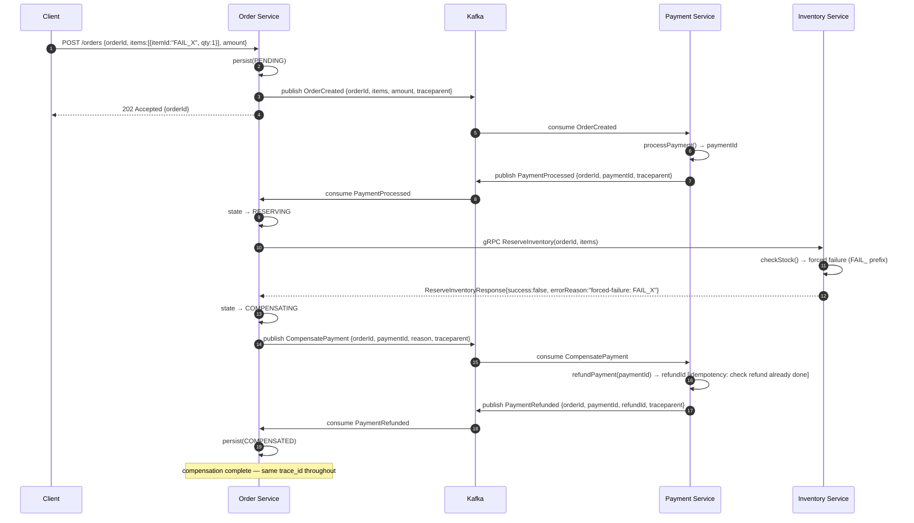

# Architecture Design — OrderSagaDemo

**Version:** 0.1.0  
**Date:** 2026-09-06  
**Status:** Ready for Developer  
**Inputs:** `docs/requirements/SRS.md` v0.1.0, `docs/tech-stack.md` v0.1.0  

---

## 1. Open Questions Resolution (OQ-1 … OQ-10)

| # | Question | Decision |
|---|---|---|
| **OQ-1** | Primary language | **Go 1.23** — static binaries, first-class gRPC/OTel/Kafka ecosystem, tiny distroless images, portfolio-friendly. |
| **OQ-2** | Saga model | **Orchestration** — the Order Service owns the saga state machine and drives every step. Compensation logic is centralised, clearly visible in a single trace, and easy to follow in logs. No separate orchestrator binary; the Order Service is the orchestrator. |
| **OQ-3** | Kafka serialisation | **JSON** with documented Go-struct schemas. No Schema Registry container; events are human-readable and inspectable with standard Kafka tools, which aids the portfolio demo story. |
| **OQ-4** | OTel Collector topology | **Single shared OTel Collector** (one container in Compose, one Deployment in k8s). All three services export OTLP/gRPC to it; it fans out to Prometheus, Tempo, and Loki. |
| **OQ-5** | Repository layout | **Monorepo** — confirmed by SRS assumption A-2. Single `go.mod`, all services under `cmd/` and `internal/`. |
| **OQ-6** | Kubernetes flavour / API version | **kind v0.24.0**, targeting Kubernetes **1.30** API. `apiVersion: apps/v1` for Deployments; `kubeVersion: ">=1.28.0"` in Helm chart. |
| **OQ-7** | Grafana dashboard provisioning | **ConfigMap + JSON files committed to repo**. In Compose: JSON files mounted as volumes into `/etc/grafana/provisioning/`. In Kubernetes: ConfigMaps mounted at the same path. No Grafana sidecar. |
| **OQ-8** | Build system / toolchain | **GNU Make** + **Go modules** + **buf** for proto. See `docs/tech-stack.md` §2. |
| **OQ-9** | Test scope | **Unit tests** (per internal package, no external runtime) + **Integration tests** (Testcontainers-Go, exercises full Compose stack). No contract tests (buf lint enforces the proto contract). |
| **OQ-10** | Helm chart distribution | **Repo-only** — chart committed to `deploy/helm/ordersagademo/`; no external registry push required. |

---

## 2. Architecture Overview

### 2.1 Component Diagram



### 2.2 Service Responsibilities

| Service | Ports | Role |
|---|---|---|
| **Order Service** | HTTP `8080` (client entry), Kafka consumer/producer | Accepts order creation; owns the saga state machine; calls `ReserveInventory` gRPC; publishes compensation commands. |
| **Payment Service** | Kafka consumer/producer only (no external port) | Stateless worker: processes `OrderCreated` → emits `PaymentProcessed`/`PaymentFailed`; processes `CompensatePayment` → emits `PaymentRefunded`. |
| **Inventory Service** | gRPC `9090`, Kafka producer | Serves `ReserveInventory` and `ReleaseInventory` RPCs; emits audit events `InventoryReserved`/`InventoryReleased` to Kafka after each successful gRPC call. |

---

## 3. Saga Design

### 3.1 Order Saga State Machine

The state machine lives entirely inside the Order Service.

```
                   ┌────────────┐
  CreateOrder ────>│  PENDING   │──── publish OrderCreated ────>┐
                   └────────────┘                                │
                                                                 ▼
                                                    ┌──────────────────────┐
                                                    │  AWAITING_PAYMENT    │
                                                    └──────────────────────┘
                                                       │                │
                                            PaymentProcessed       PaymentFailed
                                                       │                │
                                                       ▼                ▼
                                            ┌──────────────┐     ┌──────────┐
                                            │  RESERVING   │     │  FAILED  │
                                            └──────────────┘     └──────────┘
                                               │           │
                                     gRPC OK   │           │  gRPC FAIL
                                               ▼           ▼
                                         ┌──────────┐  ┌──────────────────┐
                                         │COMPLETED │  │  COMPENSATING    │──publish CompensatePayment──>┐
                                         └──────────┘  └──────────────────┘                             │
                                                                                                         ▼
                                                                                               ┌──────────────────┐
                                                                                               │  COMPENSATED     │
                                                                                               └──────────────────┘
                                                                        (on consuming PaymentRefunded)
```

### 3.2 Happy Path — Sequence Diagram



### 3.3 Compensation Path — Sequence Diagram



---

## 4. gRPC Contract Surface

**File:** `proto/inventory/v1/inventory.proto`  
**Package:** `inventory.v1`  
**Go package option:** `github.com/vladiant/ordersagademo/internal/gen/inventory/v1;inventoryv1`

### 4.1 Service Definition (design-level pseudocode)

```
service InventoryService {
  rpc ReserveInventory (ReserveInventoryRequest)  returns (ReserveInventoryResponse);
  rpc ReleaseInventory (ReleaseInventoryRequest)  returns (ReleaseInventoryResponse);
}
```

`ReleaseInventory` is included for completeness and future compensation scenarios where inventory was successfully reserved and then must be rolled back. It is not exercised in the current forced-failure path (which fails at reservation time).

### 4.2 Message Shapes (design-level)

```
ReserveInventoryRequest
  string   order_id        // saga correlation key
  repeated ItemQuantity items

ItemQuantity
  string  item_id
  int32   quantity

ReserveInventoryResponse
  bool    success
  string  reservation_id   // set on success; empty on failure
  string  error_reason     // set on failure; empty on success

ReleaseInventoryRequest
  string  order_id
  string  reservation_id

ReleaseInventoryResponse
  bool    success
  string  error_reason
```

### 4.3 OTel Interceptors

Both the Inventory Service **server** and the Order Service **client** must register `otelgrpc.UnaryServerInterceptor` / `otelgrpc.UnaryClientInterceptor`. This ensures gRPC calls appear as child spans within the saga's root trace.

---

## 5. Kafka Topics & Event Schemas

### 5.1 Topic Inventory

| Topic | Partitions | Producer | Consumers |
|---|---|---|---|
| `saga.orders.created` | 1 | Order Service | Payment Service |
| `saga.payments.processed` | 1 | Payment Service | Order Service |
| `saga.payments.failed` | 1 | Payment Service | Order Service |
| `saga.payments.compensate` | 1 | Order Service | Payment Service |
| `saga.payments.refunded` | 1 | Payment Service | Order Service |
| `saga.inventory.reserved` | 1 | Inventory Service | (audit; no active consumer required) |
| `saga.inventory.released` | 1 | Inventory Service | (audit; no active consumer required) |

Replication factor: `1` (single-broker demo).  
Topics are auto-created on first publish OR created via a Compose init container — Developer's choice.

### 5.2 Event Schemas (JSON)

All events share a common envelope. The `trace_context.traceparent` field carries the W3C TraceContext header value for OTel propagation across Kafka. Producers inject it; consumers extract it and attach the resulting span context as parent before creating child spans.

```
// Shared envelope fields present in every event
{
  "event_type":      string,          // e.g. "OrderCreated"
  "event_id":        string (UUID),   // idempotency key for consumers
  "timestamp":       string (RFC3339),
  "trace_context": {
    "traceparent":   string           // W3C traceparent: "00-<traceId>-<spanId>-01"
  }
}
```

```
// OrderCreated  (topic: saga.orders.created)
+ "order_id":        string
+ "items":           [{item_id: string, quantity: int}]
+ "payment_amount":  number (float64)

// PaymentProcessed  (topic: saga.payments.processed)
+ "order_id":        string
+ "payment_id":      string

// PaymentFailed  (topic: saga.payments.failed)
+ "order_id":        string
+ "reason":          string

// CompensatePayment  (topic: saga.payments.compensate)
+ "order_id":        string
+ "payment_id":      string
+ "reason":          string

// PaymentRefunded  (topic: saga.payments.refunded)
+ "order_id":        string
+ "payment_id":      string
+ "refund_id":       string

// InventoryReserved  (topic: saga.inventory.reserved)
+ "order_id":        string
+ "reservation_id":  string

// InventoryReleased  (topic: saga.inventory.released)
+ "order_id":        string
+ "reservation_id":  string
```

### 5.3 Consumer Idempotency

Each consumer maintains an in-memory `map[eventID]bool` (keyed on `event_id` from the envelope). If an event with a previously-seen `event_id` arrives, the consumer logs a warning and discards it without re-processing. This satisfies FR-13.

---

## 6. Forced-Failure Mechanism

**Mechanism:** item ID prefix convention, configured via environment variable.

| Env var | Default | Effect |
|---|---|---|
| `INVENTORY_FAIL_ITEM_PREFIX` | `FAIL_` | Any `item_id` that starts with this prefix causes `ReserveInventory` to return `success:false` with `error_reason:"forced-failure: <item_id>"`. Set to empty string to disable. |

**Demo trigger:** include any item with `item_id: "FAIL_ITEM_01"` in the order creation request. This is documented in the README (NFR-20, FR-14).

**No source-code modification required at demo time** — the env var is set in `deploy/docker-compose/docker-compose.yml` for the failure scenario and overridden to empty in the happy-path compose file / override.

---

## 7. Observability Design

### 7.1 Signal Pipeline

```
┌─────────────────────────────────────────────────────────┐
│  Each Service (Go OTel SDK)                             │
│  • TraceProvider  → OTLP exporter (gRPC :4317)         │
│  • MeterProvider  → OTLP exporter (gRPC :4317)         │
│  • LoggerProvider → OTLP exporter (gRPC :4317)         │
└────────────────────────┬────────────────────────────────┘
                         │ OTLP/gRPC
                         ▼
              ┌──────────────────────┐
              │   OTel Collector     │
              │  receivers: otlp     │
              │  processors:         │
              │    batch, memory_limiter │
              │  exporters:          │
              │    prometheusremotewrite → Prometheus :9090  │
              │    otlp/tempo        → Tempo :4317           │
              │    loki              → Loki :3100            │
              └──────────────────────┘
```

### 7.2 Trace-to-Log Correlation

1. Every structured log record produced by a service includes `trace_id` and `span_id` as top-level fields (injected by the OTel log bridge; all log calls go through `slog` with the OTel handler).
2. The OTel Collector ships logs to Loki; Loki indexes `trace_id` as a label.
3. In Grafana: the Tempo datasource has a **Derived Fields** rule: field `trace_id` → Loki query `{service_name="${service}"} | json | trace_id="${__value.raw}"`.
4. Result: clicking any span in Tempo opens the correlated Loki log stream — satisfying AC-5 and NFR-10.

### 7.3 Metrics

Minimum metric set emitted by each service (using OTel metric instruments):

| Metric Name | Type | Labels | Meaning |
|---|---|---|---|
| `saga_orders_total` | Counter | `status` (completed, failed, compensated) | Order outcomes |
| `saga_step_duration_seconds` | Histogram | `step` (payment, reservation, compensation) | Per-step latency |
| `saga_compensation_total` | Counter | `reason` | Rollback count — directly visible in dashboards |
| `grpc_server_handled_total` | Counter | `grpc_method`, `grpc_code` | gRPC call outcomes (from otelgrpc) |
| `kafka_messages_produced_total` | Counter | `topic` | Kafka producer throughput |
| `kafka_messages_consumed_total` | Counter | `topic`, `consumer_group` | Kafka consumer throughput |

### 7.4 Alerting Rules

Committed to `observability/prometheus/rules/saga-alerts.yaml`:

| Alert | Condition | Severity |
|---|---|---|
| `SagaCompensationRateHigh` | `rate(saga_compensation_total[5m]) > 0` for `> 1m` | warning |
| `PaymentFailureRateHigh` | `rate(saga_orders_total{status="failed"}[5m]) / rate(saga_orders_total[5m]) > 0.1` | critical |

### 7.5 Grafana Dashboard Provisioning (OQ-7)

- Dashboard JSON files committed to `observability/grafana/dashboards/`.
- Grafana datasources committed to `observability/grafana/provisioning/datasources/datasources.yaml`.
- Dashboard provider committed to `observability/grafana/provisioning/dashboards/provider.yaml`.
- In Docker Compose: the three directories above are bind-mounted into the Grafana container.
- In Kubernetes: each directory becomes a ConfigMap; the Grafana Deployment mounts them at `/etc/grafana/provisioning/`.
- Dashboards to commit: `saga-overview.json` (throughput, compensation counter, step latencies) and `slo-dashboard.json` (order success rate, error budget burn).

---

## 8. Build / Target Structure

### 8.1 Go Binaries

| Binary | Build target | Dockerfile |
|---|---|---|
| `order-service` | `./cmd/order` | `services/order/Dockerfile` |
| `payment-service` | `./cmd/payment` | `services/payment/Dockerfile` |
| `inventory-service` | `./cmd/inventory` | `services/inventory/Dockerfile` |

### 8.2 Multi-Stage Dockerfile Pattern (same structure for all three)

```
Stage 1 — builder:  golang:1.23-alpine
  WORKDIR /app
  COPY go.mod go.sum ./
  RUN go mod download
  COPY . .
  RUN CGO_ENABLED=0 GOOS=linux go build -trimpath -o /bin/<service>-service ./cmd/<service>

Stage 2 — runtime:  gcr.io/distroless/static-debian12
  COPY --from=builder /bin/<service>-service /
  USER nonroot:nonroot
  ENTRYPOINT ["/<service>-service"]
```

Note: all three Dockerfiles use the **repo root** as build context so they share `go.mod`, `go.sum`, and `internal/gen/`.

### 8.3 Internal Package Boundaries

```
internal/
  gen/inventory/v1/       → generated proto; imported by Order + Inventory services
  order/
    api/                  → HTTP handler (depends on saga/)
    saga/                 → state machine; no HTTP/Kafka imports (pure logic — testable)
    kafka/                → producer + consumer wiring
    store/                → in-memory order store (interface + map implementation)
  payment/
    kafka/                → consumer + producer wiring
    ledger/               → in-memory payment ledger (interface + map)
  inventory/
    grpc/                 → gRPC server handler (depends on store/)
    store/                → in-memory stock store (interface + map)
  telemetry/              → shared OTel setup: TraceProvider, MeterProvider, LoggerProvider init
  messaging/              → shared Kafka helpers: envelope encode/decode, traceparent inject/extract
```

**Ownership model:** all in-memory stores use a `sync.RWMutex`-guarded map. Interfaces are defined next to their consumers (dependency inversion) so unit tests can substitute fakes without importing the real implementations.

### 8.4 Dependency Injection Strategy

Each service binary's `main.go`:
1. Reads config from environment variables.
2. Initialises OTel providers (via `internal/telemetry`).
3. Constructs concrete store implementations.
4. Wires them into handler/saga structs via constructor injection.
5. Starts HTTP/gRPC server and Kafka consumers; blocks on signal.

No global state or `init()` side-effects in non-`main` packages. This keeps every package unit-testable without a running Kafka or Prometheus instance.

---

## 9. Design Decisions & Trade-offs

| Decision | Chosen | Alternative(s) Considered | Rationale |
|---|---|---|---|
| Saga model | Orchestration (Order Service as orchestrator) | Choreography | Centralises compensation logic; a single trace tree makes the portfolio narrative clearer; compensation is triggered by explicit state transitions, not implicit event-reaction chains. |
| Serialisation | JSON | Avro+Schema Registry, Protobuf | Eliminates Schema Registry container; events are readable in `kafka-console-consumer`; no code-gen step for event types; acceptable latency for a demo. |
| Kafka client | `segmentio/kafka-go` | `confluent-kafka-go` | Pure Go = no CGo = simpler Alpine/distroless builds; sufficient at-least-once semantics; well-maintained. |
| OTel topology | Single shared Collector | Sidecar per service | Sidecar topology adds per-service containers and k8s manifest complexity that distracts from the portfolio story; shared Collector is standard for small clusters. |
| In-memory stores | `sync.Map` / guarded maps | Embedded SQLite, Redis | Avoids database container sprawl; state loss on restart is acceptable (A-4 spirit); makes unit tests trivial. |
| Log routing | OTel log bridge → OTLP → Loki | Promtail scraping log files | Keeps all three signals on one OTLP path; no file-mounting needed; trace/span IDs are automatically attached. |
| gRPC code-gen | buf | Raw protoc | buf handles plugin management, linting, and breaking-change detection in a single CLI; no system-level protoc install required. |
| Helm distribution | Repo-only | OCI registry, chart repo | This is a portfolio demo, not a production release; repo-only is simpler and sufficient. |

---

## 10. Risks & Constraints the Developer Must Respect

| Risk / Constraint | Impact | Mitigation |
|---|---|---|
| **R-1** Kafka consumer idempotency MUST be implemented | Double-refund in AC-9 | Use `event_id` deduplication map in each consumer (§5.3). |
| **R-2** OTel trace context MUST flow across Kafka headers | AC-4 broken if absent | Use `internal/messaging` helpers to inject/extract `traceparent` into Kafka message headers on every produce/consume. |
| **R-3** gRPC interceptors on BOTH sides | AC-3 / AC-4 broken | Register `otelgrpc` interceptors on both the Inventory Service server and the Order Service client. |
| **R-4** Grafana datasource UIDs must be stable | Tempo→Loki link breaks | Hard-code datasource UIDs in `datasources.yaml` and reference them in dashboard JSON — do not use auto-generated UIDs. |
| **R-5** All Dockerfiles use repo root as build context | CI/CD, `docker build` invocation | `docker build -f services/<svc>/Dockerfile .` — always invoked from repo root. |
| **R-6** `INVENTORY_FAIL_ITEM_PREFIX` must be wired at the Compose level | AC-7 / FR-14 | Set in compose service env block; README must show how to change it. |
| **R-7** `event_id` must be a stable UUID per message (not regenerated on retry) | Idempotency | Producers generate the UUID once before the publish call, before any retry loop. |
| **R-8** Missing requirement: Kafka topic creation strategy | Blocks service start-up | Either auto-create via broker config `KAFKA_AUTO_CREATE_TOPICS_ENABLE=true` or add an init container. Developer must choose and document. **Flag to Requirements Analyst as a missing operational requirement.** |

---

*Design is ready for the Developer agent to implement.*
